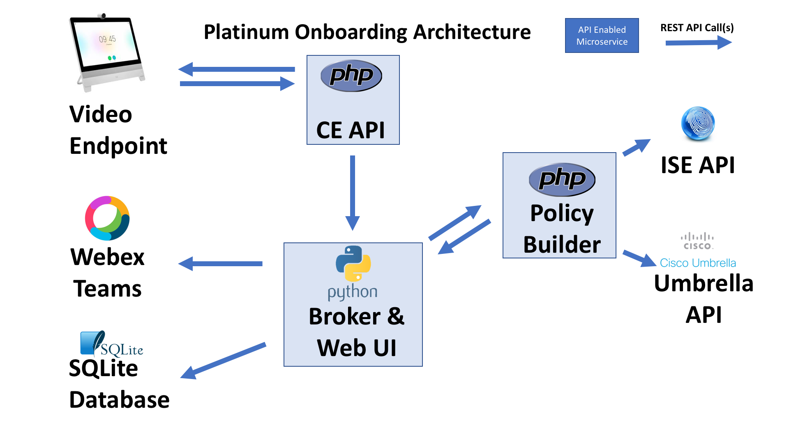

# platinum-onboard

PoC for onboarding new users onto a network

## Business/Technical Challenge

Onboarding guest onto a network has been made simpler over the years by advances in identity solutions and wireless networks.   However, customers still experience pain points when adding users.   Some of these are:

* There still needs to be manual intervention to create the guest account.   This can be a lobby ambassador or guest sponsor.
* Some customers are unable to open up a captive portal due to customer restrictions.   This makes it impossible to log on to the network.
* Once a user has been successfuly onboarded, the host company has little visibility of what the user has been doing.
* Users get frustrated so they start using hotspots or cell phones for accessing networks.

These are just several of the problems that are associated with onboarding guest users.   Contractor access is even more problematic since they are onsite so infrequently, so IT departments often have to reenable the contractors credentials at each visit.  Even worse, IT departments attempt to avoid this by giving the contractor an account with credentials permanently enabled with no password 60 or 90 day age restrictions.  The problems are even made worse when the amount of guest users increase.   For example, at a customer trade show when there could be thousands of guest or contractor users.

With the increase of technological features, there must be a better solution to address this problem!

## Proposed Solution

Cisco has already made tremendous strides in solving this problem through both its networking platforms as well as Identity Services Engine.  There are, however, a few ways that these platforms can still be brought together to better provisioning as well as increase the control and accountability system wide.

Our proposed solution is based upon Cisco's Intelligent Proximixty feature and Cisco WebEx Teams.   This solution allows endpoints to dynamically detect devices and users that are in range.   We are planning to leverage the proximity feature to serve as the backbone of our platinum onboarding solution.   This solution will automatically detect guest or contractor users and with that information we will begin to onboard the user onto the network.   

The core to the entire system will in fact be the Identity Services Engine (ISE).  It’s a powerful policy platform with an open API.  It’s PxGrid capabilities make it a great hub for control and policy in both Cisco and non-Cisco centric environments.  And to provide the visibility, Cisco Umbrella will be leveraged to monitor and keep track of what the user is doing.

The solution can be deployed in several different use cases:
* Conference Rooms - When guest users enter the conference room, they will be automatically onboarded as users on the network.
* Kiosks - Users can walk up to a kiosks and automatically be onboarded onto the network.
* Registration - Instead of registering for services by entering identification like SS#, the platinum onboard feature can be used to quickly register these users using the capabilities built into their mobile devices.

By combining these best of bread products together, customers can enjoy much more streamlined workflow to bring on new users.

### Cisco Products Technologies/ Services

Our solution leverages the following Cisco technologies:

*  [WebEx Teams](https://www.webex.com/products/teams/index.html)
*  [WebEx Room Series](https://www.cisco.com/c/en/us/products/collaboration-endpoints/webex-room-series/index.html)
*  [Cisco Video Endpoint XAPI](https://www.cisco.com/c/dam/en/us/td/docs/telepresence/endpoint/ce94/collaboration-endpoint-software-api-reference-guide-ce94.pdf)
*  [Cisco Intelligent Proximity](https://www.cisco.com/c/en/us/products/collaboration-endpoints/intelligent-proximity.html)
*  [Identity Services Engine (ISE)](http://cisco.com/go/ise)
*  [Cisco PxGrid](http://www.cisco.com/go/pxgrid)
*  [Umbrella](http://www.cisco.com/go/umbrella)

## Team Members

* Chris Bogdon <cbogdon@cisco.com> - Trans PNC Enterprise Account
* Jason Beltrame <jabeltra@cisco.com> - Greater Pennsylvania Territory
* Adam Schaeffer <adschaef@cisco.com> - Philadelphia Metro Territory

## Solution Components

Our solution provides three main components.   The architecture is built around a microservices framework to demonstrate how multiple solutions can work together as long as there is a well defined API.   The overall architecture is shown below:

There are three main modules in the solution.   They are described below:

### CE-API
The CEAPI module listens for provisioning requests from video endpoints.  When the "Network Registration"
button is pressed the endpoint will send an HTTP Feedback request to the CE API Service.  This service then
requests the broker to provision the account.  

The CE API performs the following functions:
1. Listens for HTTP Feedback requests
2. Validates and received requests
3. Sends a pop up confirmation back to the video endpoint
4. When the user confirms he/she would like an account provisioned the service with make a call to the Broker to have the request processed.
5. A confirmation message is sent to the Video endpoint so the user knows the process is underway.

### broker
The broker is responsible for receiving requests from the CE-API to provision guest users.   It uses a database to whitelist both video endpoints and email domains to provide a very simple security mechanism.

The broker, will perform the following functions:
1. Wait for requests from the CE-API to provision a user
2. Validate any received requests against the security white-list database
3. Store the requests in an internal database for later tracking
4. Leverage the REST-API to initiate the actual provisioning process with the guest-update.
5. Wait for response from guest-update for a wifi password
6. Provide status updates to the end user in a WebEx Teams Room

### guest-update
The guest-update is responsible for receiving user requests from the broker to provision guest users within ISE.  It uses various ISE API's to validate and create users.

The guest-update will perform the following functions:
1.  Will wait for requests from the broker to provision a user within the ISE guest database.
2.  It will make sure the user is not already there, and if not, it will provision the new user.
3.  If the user already exists, it will re-active the account, and reset the password.
4.  In both of those cases, it will send an update back to the broker with a status of completed as well as the current password.
5.  The infrastructure itself ( ISE, WLC and Umbrella ) are setup and integrated with API's to allow for dynamic policy based on the company the user is from.  See the Readme.md under guest-update for more information.

## Usage

### Prerequisite
Besides having the modules configured appropriately, the end user will be required to have a Cisco WebEx Teams Account and WebEx Teams installed on their mobile device.    To set up a free WebEx Teams Account, you can go to the following link: [WebEx Teams](https://www.webex.com/pricing/free-trial.html?sp=wt)

To download the WebEx Teams application, you can click on the following links:

**Apple IOS**

**Android**

### Overall Flow

## Installation

Since there are three distinct modules required, the detailed information for installation is included in the documentation links provided in the next section.

## Documentation

More detailed information and documentation can be provided in the following links:

* [CE-API](ceapi/README.md)
* [broker](broker/README.md)
* [guest-update](guest-update/README.md)

## License

Provided under Cisco Sample Code License, for details see [LICENSE](./LICENSE.md)

## Code of Conduct

Our code of conduct is available [here](./CODE_OF_CONDUCT.md)

## Contributing

See our contributing guidelines [here](./CONTRIBUTING.md)
