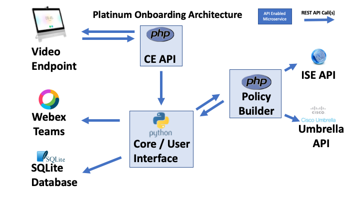

# Platinum Onboard - Broker

## Description
The broker micro-service is responsible for receiving requests to provision users and then forwards these requests to the service responsible for provisioning users.    See the following picture on where it fits in the overall solution:

**Architecture:**


The broker micro-service leverages a REST API to communicate between the different services.  In addition, the broker micro-service provides a GUI to allow you to view and modify any of the data base tables that are used to store information.

## Functional Details
The broker micro-service will receive requests from external sources for process and provision guest wireless users.   The broker will not actually provision the users, but will make a call to some external entity to actually provision the users.   However, the following is a detail of the functions and how it works.

#### Initiation of guest account
The initiation of the guest account will begin with the REST API Call ```/api/generate-guest-account``` passed with both the ```deviceid``` that the request is coming from and the ```teamsid``` of the user that is requesting the guest account.   Once the broker receives the request it will validate the parameters against the security mechanism described below.   If the request passed the security checks, then broker will then update the WebEx Teams room with an update message and then send a request to the provisioning engine to complete the process.

#### Security
There is a very basic security model built into the application.   The broker will validate two pieces of information before a user can be provisioned Device ID and Email Domain.

##### Device ID
Since the broker will be responsible for receiving requests from end user devices (ie., Video Terminals or WebEx Boards), the broker will first determine if the request came from a valid device.   The broker has a database table that stores the deviceid of every device that is allowed to request guest accounts.   If the deviceid is not in the whitelist database, then the creation will fail.   You can leverage the  ```/api/post-endpoint-id``` REST API call or the GUI  to add new end points to the database.

##### Email Domain
Similar to the device, there is also a check as to the domain that the request is coming from.   Therefore, everyone's email domain must also be added. Similarly to the Device ID, a database table is used the house the white list domains.   You can leverage the ```/api/post-email-domain``` REST API call or the GUI to add new email domains to the database

#### Completion of the guest account
Once the provisioning engine is completed with the request, it will send a message to the broker to update the status to completed.   You can leverage the ```/api/update-status-guest-account``` REST API call with the status of ```completed``` and the guestpassword set to the password that is provisioned.   Once the broker retrieves this data everything is passed to the WebEx Teams Room and then the user will be successfully provisioned.

## GUI
A very simple GUI is provided to assist the user in performing maintenance on the system.   To open up the GUI, just point your web browser to the IP addresses that the broker is listening on.   For example: ```http://127.0.0.1:5000```

### Main Screen
The main screen provides both a Main Menu and a Top Menu for navigation.

![Main Menu] (img/mainmenu.png)

#### Main Menu
The main manu will provide the main functions to maintain the database.   You can add data to tables, dump the tables and clear individual or all tables.

#### Top Menu
The top menu is a navigation menu that will show an about the software or take you back to the main menu.

### Add to Device Table
You can use the Add to Device Table to add new video devices to the whitelist table.
![Add To Device Table] (img/addtodevice.png)

### Add to Domain Table
You can use the Add to Domain Table to add new email domains to the whitelist table.
![Add To Domain Table] (img/addtodomain.png)

### Dump the Device Table
You can use the Dump Device Table to display the contents of the device table.
![Dump Device Table] (img/dumpdevice.png)

### Dump the Domain Table
You can use the Dump Domain Table to display the contents of the domain table.
![Dump Domain Table] (img/dumpdomain.png)

### Dump the Guest Table
You can use the Dump Guest Table to display the contents of the guest table.
![Dump Guest Table] (img/dumpguest.png)


## Requirements
The broker micro-service is written entirely in Python version 3.6.  The ```requirements.txt```file describes all the module dependencies that are required for the broker micro-service.

### SQLite
The broker micro-service also requires SQLite database.   Details on the SQLite database are described in the following website: http://www.sqlite.org.   SQLite is one of the most widely deployed databases for embedded software development and is normally installed my most python installations.    In addition, there is a great command line utility for sqlite called ```sqlite3```.   You can fine more information about that here: https://www.sqlite.org/cli.html

### WebEx Teams
Webex Teams is an app for continuous teamwork with video meetings, group messaging, file sharing and white boarding.  For the platinum-onboard solution, we are using WebEx Teams to send back user status information to the person requesting Guest WiFi Access.  You can sign up for a WebEx Teams account requires you to sign up for an account at http://teams.webex.com.  For configuration of the broker service you will need your WebEx Teams API key.   This API key can be found at the following instructions:

1. Go to http://developer.webex.com
2. In the upper right hand corner, click the log-in button.
3. Enter your WebEx Teams, username and password
4. You can then go to any of the links of the API Reference.   For example: https://developer.webex.com/docs/api/v1/teams/list-teams
5. On the right hand side of the screen you should see a section to try the API.   In the bearer field, this hidden value is the API Key.   If you hit the copy button, that will save the API key.
6. Store the API key somewhere safely, since we will need that for configuration.

## Configuration
To configure the application, you can leverage the ```package-config.ini```.   Within the repository is a sample one that you can use to customize for your own installation.   An example is provided below:

```bash
[platinum-onboard]
url: https://api.ciscospark.com
token: {Insert WebEx Teams Token}
listen-ip: {Insert IP to Listen on}
listen-port: {Insert Port to Listen on}
provision-ip: {Insert Provision IP Module}
webdebug: False
```

The parameters are described below:
* **url** - This paramter represents the URL that WebEx Teams will use for API calls.   This should normally be, https://api.ciscospark.com, but it you ever need to change it, you can use this parameter.
* **token** - This parameter represents the WebEx Teams Token that you copied in the WebEx Teams section above.   This is the API Key that the broker micro-service will use to communicate with the WebEx Teams Application
* **listen-ip** - This parameter represents the IP Address that the broker micro-service will listen to for REST API Calls.   If you use the ```0.0.0.0```, then the platinum-onboard will listen to all available IP addresses for REST API calls.
* **listen-port** - This parameter represents the port that should be used to listen for REST API Calls.   
* **provision-ip** - This parameter represents the IP Address and port combination to send requests to provision guest users to.   The format is: {IP Address}:{IP Port}.   For example, 192.168.0.1:9800.
* **webbbdebug** - This parameter represents a debug flag that will turn on more detailed debugging to the console.

## Starting the Broker
To start the broker, after the configuration occured, use the following command:

```python3 platinum-onboard.py```

Once the application has successfully started, you should see:

```
Platinum Onboard Engine Starting...

Configuration Options:
teamsurl: https://api.ciscospark.com
teamstoken : {HIDDEN}
listenip: 0.0.0.0
listenport: 5000
provision-ip: 192.168.0.1:9800
Initializing the database: platinum-onboard.sqlite
2.6.0
 * Serving Flask app "platinum-onboard" (lazy loading)
 * Environment: production
   WARNING: Do not use the development server in a production environment.
   Use a production WSGI server instead.
 * Debug mode: on
 * Running on http://0.0.0.0:5000/ (Press CTRL+C to quit)
 * Restarting with stat
Platinum Onboard Engine Starting...

Configuration Options:
teamsurl: https://api.ciscospark.com
teamstoken : {HIDDEN}
listenip: 0.0.0.0
listenport: 5000
provision-ip: 192.168.0.1:9800
Initializing the database: platinum-onboard.sqlite
2.6.0
 * Debugger is active!
 * Debugger PIN: 143-174-706
 ```

## GUI

## API Description
All the following API calls can be made, but calling:

```http://{ip address}:{port}/api/{api call}&{parameter}={value}```

As an example, if we want to add a domain to the white list, we POST following REST API call:

```http://192.168.0.0.1:5000/api/post-email-domain?domain=cisco.com```

Then we will retreive and JSON response which contains a unique identifier for the record that was inserted.

```bash
{
    "result": "tzrjFnw0REGoJWmPHm8CFw"
}
```


#### /api/get-user-by-id
**Request Type:** GET

**Parameter**: ```teamsid```

**Description:** Returns a JSON that contains the email address for the WebEx Teams user that is specified by the teamsid parameter.   The Teams ID Parameter is a descriptor used by the WebEx Teams application.

#### /api/get-detailed-info-by-id
**Request Type:** GET

**Parameter**: ```teamsid```

**Description:** Returns a JSON that contains the detailed information for the WebEx Teams user that is specified by the teamsid parameter.   The Teams ID Parameter is a descriptor used by the WebEx Teams application.   This API call retrieves all information including:  avatar, full name, email address, etc.

#### /api/get-email-domain
**Request Type:** GET

**Parameter**: ```domain```

**Description:** Returns a JSON that represents if the email domain is in the white-list database.

#### /api/post-email-domain
**Request Type:** POST

**Parameter**: ```domain```

**Description:** Enters a new email domain into the white-list database.   Returns a JSON if the operation was succesful.

#### /api/get-endpoint-id
**Request Type:** GET

**Parameter**: ```deviceid```

**Description:** Returns a JSON that represents if the device with the deviceid is in the white-list database.

#### /api/post-endpoint-id
**Request Type:** POST

**Parameter** ```deviceid```

**Description:** Enters a new device domain into the white-list database.   Returns a JSON if the operation was succesful.

#### /api/generate-guest-account
**Request Type:** POST

**Parameter** ```deviceid``` and ```teamsid```

**Description:** Initiates a process to generate a new guest account from a user with the ```teamsid``` from device ```deviceid```.   A JSON is returned to determine if the process was successful.

#### /api/status-guest-account
**Request Type:** GET

**Parameter** ```email```

**Description:** Returns the JSON to respresent the current status of the guest account.

#### /api/update-status-guest-account
**Request Type:** POST

**Parameter** ```email```, ```status``` and ```guestpassword```

**Description:** Updates the statu of the guest account.   Normally there are two statuses: ```initiated``` and ```completed```.   Once the provisioning engine provisioned the guest account successfully, you can then use this call to update the status of the user to completed.   This process will then forward the guest credentials to the user.

