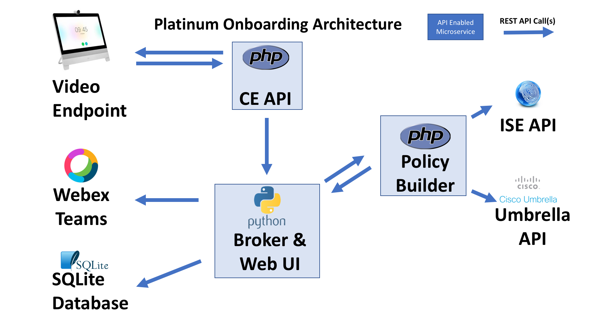

# Telepresense Endpoint API

## Introduction

This module allows a user to walk up to a Webex Registered Cisco video endpoint, pair automatically
to the device using Webex Teams installed on a mobile device, and start a self service guest registration
process with a single click.  

This module handles the communications and control between the endpoint and the Broker service.  It also
generates the one screen messages to the end by leveraging the API on the video endpoint.

## Functionality

This module performs the key functions between the Cisco Endpoints registered to the Cisco Webex Cloud
and the Broker module.  As you can see in the architecture diagram the Video endpoints, when configured
as described below, will make API calls to this module in the form of httpfeedback requests.  This
module will then in turn make API requests to API's on the video endpoint to collect additional information
and generate user facing menu options.  The information collected is the Webex Teams ID of the users paired
with the video endpoint.  Menus and messages will guide the user and give confirmations as the provisioning
is successfully initialized.  

The architecture diagram below shows this module in the upper left.  This module and the video endpoints
make requests to each other in each direction.  This module will then also make calls to the Broker service
to complete the provisioning processes.  The broker will always reply with a detailed result on which this
module will log the results and push an on screen notification to the video endpoint originating the request.

**Architecture:**


## The Undocumented API

*Note:  Part of this application leverages an undocumented API on the video endpoints.*

The undocumented API is in fact the API that is used to build the web GUI interface when administering
the endpoint.  This API is not documented by Cisco, is not supported at this time, and is subject to change
in functionality and format in the future.

To understand this API, browser-based development tools were used to watch the http requests as the
web admin GUI was loaded.  The reverse engineering process was trial and error based.  The root of the
API is *https://{ip address}/web/api/*.  This application pruned the resulting data by using the more
specific *https://{ip address}/web/api/status/Spark/PairedDevice*.  The data is returned in JSON format
and then parsed into an array by this module.

## Configuration / Service Setup

To install this application prepare a unix based Apache / PHP Server and follow the guide below.
In this guide we will assume the default server directory is /var/www/html

1. Copy all PHP files in this CEAPI directory to your web server.
```
cd ./platinum-onboard/ceapi
cp *.php /var/www/html
```
2. Create the configuration file from the sample-config.php file.  Edit the file
as needed for your environment.
```
cp sample-config config.php
nano config.php
```
3. Edit the file according to your needs.  The username and password are for authentication
to your video endpoints.  The application must authenticate to your endpoints to extract the
teams ID needed to create a user account.  These credential must have admin level access
on the video endpoint.
The "Broker" variable can be an IP address and port number for the borker service.  This is
the address the CEAPI code will make API calls to to ultimately create user accounts.
The broker can run on the same system (on a different tcp port 127.0.0.1) or a remote system.
You can see the sample configuration file contents below:

```php

//telepresense endpoint service account username and password
//must be admin
$username = 'username';  
$password = "password";

//The broker service IP address and port number if not 80
$broker = "192.168.1.11:8080";
```
4. The CEAPI generates a log file to assist in troubleshooting and development. To
use this file you have to create it and enable it to be written to by the Apache user.

```
touch log
chmod +w log
```


### Video Endpoint Setup

1.  Import the xml file to your video endpoint's "In Room Controls" panel.  This
provides the GUI button to allow registrants to start the process.  At this time
other controls aside from the controls included in this module are not supported.


Next, on your video endpoint you will need to have HTTP Feedback enabled.  SSH into
the endpoint and use the CLI command below substituting details for your instance
of the CEAPI service.  

*Please note that the path could be the root of the server or a sub directory
depending on how you deploy the application.  Always include the trailing slash
in the serverURL parameter*

```
xcommand HttpFeedback Register FeedbackSlot: 1
Expression: /Event/UserInterface/Extensions/Panel/Clicked
Expression: /Event/UserInterface/Message/Prompt/Response
Format: JSON
ServerUrl: http://<ip address>/platinum-onboard/ceapi/
```

You can verify the feedback registration with the "xstatus HttpFeedback" command

```
xstatus HttpFeedback
*s HttpFeedback 1 Expression 1: "/Event/UserInterface/Extensions/Panel/Clicked"
*s HttpFeedback 1 Expression 2: "/Event/UserInterface/Message/Prompt/Response"
*s HttpFeedback 1 Format: "JSON"
*s HttpFeedback 1 Status: OK
*s HttpFeedback 1 URL: "http://192.168.1.11/platinum-onboard/ceapi/"
** end

OK
```
